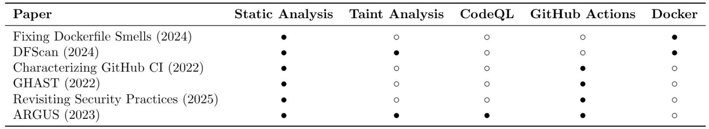
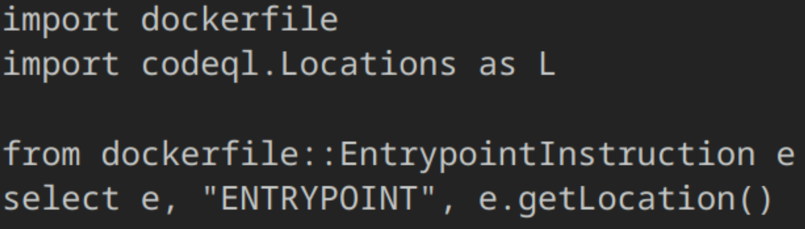
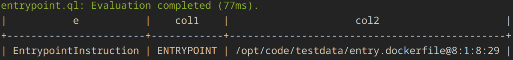
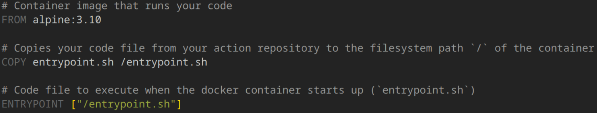

# Introduction

Many vulnerabilities are caused by untrusted user input. Such vulnerabilities can be detected through static taint analysis. Static taint analysis works to identify variables that may contain untrusted input, called sources, and trace them to potential vulnerable outputs, or sinks. This project works to perform static taint analysis on Docker actions used in GitHub Workflows. GitHub Workflows are used for Continuous Integration / Continuous Deployment (CI/CD) activities in GitHub. Workflows are defined in a YAML file that contains a number of jobs or tasks to run for a repository. These can include any build or test jobs. Workflows may leverage a number of different Actions. The three primary types of GitHub Actions are JavaScript, Composite, and Docker, where the type indicates how the Action runs. 

GitHub Workflows are convenient and easy for developers to use, but the possibility for code injection is often neglected, leading to undetected supply chain vulnerabilities. GitHub Actions may also be leveraged to leak secrets from the host repository, which may also end in supply chain attacks. 

Our project focuses on creating Docker action support for the static taint analysis tool ARGUS. ARGUS, published in a 2023 USENIX Security paper by Muralee et al., is the first static taint analysis framework created to analyze Github Actions. The tool was presented with a 93.29% overall precision in detecting tainted actions as well as having a discovery rate that is 7 times higher than other similar tools. However, ARGUS does not implement taint analysis for Docker Actions. 30% of GitHub Actions use Docker Actions, which means that overlooking these actions likely contributes to a significant amount of false negatives. Therefore, our ultimate objective is to lower the false negative rate of ARGUS by creating a plugin to implement support for Docker Action analysis.

# Background

ARGUS uses CodeQL as a base for identifying patterns – like sources, sinks, and flows – for static taint analysis. CodeQL works as a query language that loads code into a database for analysis. Many languages are supported with CodeQL including, but not limited to: Python, Java, C, and Ruby. However, CodeQL is completely open-source, so developers can create their own extractors and query packs if a specific language or functionality is not already supported. 

Taint analysis is a thoroughly explored field, but taint analysis on Dockerfiles/Docker containers has not been as deeply investigated. Security tools for Docker often focus on package-related vulnerabilities in the image itself, not the complex data flows involved in the building and running of the container.

# Related Work

*".QL for Source Code Analysis"* (Moor et al., 2007) laid foundational groundwork for CodeQL and data analysis by creating the CodeQL model and the .QL file. This paper helped us understand how CodeQL works.

*“Fixing Dockerfile Smells”* (Rosa et al., 2024) focuses on analyzing developer habits and common commands when creating Dockerfiles. Dockerfile smells are defined as bad practices that can cause security issues when developing. This paper introduces a rule-based tool for automating fixes for these smells. We were able to use this paper for figuring out common commands to potentially integrate into our CodeQL query pack. 

*“DFScan”* (Hao, et al., 2024) introduces a Python-based Dockerfile parser and relational database to search for security vulnerabilities within Dockerfiles. While we are using CodeQL for our parser and database, this DFScan paper gave us a general idea for build despite being used for Python as it is a similar effort to what our goal is.

*“Characterizing the Security of GitHub CI Workflows”* (Koishybayev et al., 2022) discusses arbitrary code execution and secret leaks that can be found within GitHub CI Workflows. This work was a prior work by the authors of ARGUS and allowed us to have a deeper understanding of the broader idea of potential taint sources within GitHub Workflows.

*“Automatic Security Assessment of GitHub Actions Workflows”* (Benedetti et al., 2022) introduces GHAST, a static taint analysis tool, a Software Supply Chain based security assessment tool. This tool is similar to ARGUS in terms of general functionality. ARGUS analyzes GitHub CI/CD Pipelines while GHAST analyzes Software Supply Chains.

*“Revisiting Security Practices for GitHub Actions Workflows”* (Huang & Lin, 2025) continues to analyze the best security practices for GitHub Actions and Workflows. These authors cite ARGUS and use their dataset for analysis, though GHAST is their tool of choice. This paper investigates security issues found in GitHub Workflows, including command injection, misconfiguration, secret leakage, etc. This paper helped to motivate our work in creating support for Docker Actions within GitHub Workflows since 30% of GitHub Actions are within Docker Containers. Being able to find any secret leaks or injection sites within these Docker containers was our main goal.

This comparison table denotes how the chosen related works are relevant to our contribution. Our contribution to ARGUS checks off the last box.

# Challenges

We’ve encountered a number of challenges when working on creating the plugin for ARGUS. Since CodeQL is the base for ARGUS, we had to use it when creating our plugin. However, CodeQL does not natively support Dockerfiles. This means that we needed to create our own extractor and query pack for Dockerfiles in order for the plugin to be compatible with ARGUS’ taint engine. On top of that, all of ARGUS’ CodeQL queries are written in JavaScript which meant that we needed to create our own set of queries in order for ARGUS to be able to recognize our queries and plugin. Lastly, we had some trouble understanding exactly how Static Taint Analysis is run on Dockerfiles. There is very little literature on the topic, and a lot of testing needed to be done. We also needed to understand how input from the Dockerfiles are used and if our plugin even handled them correctly.

# Contributions & Methodology 

Our overall contribution: ARGUS can now be used to analyze some Docker actions, where previously it would silently skip them. 

## Contribution 1: Dockerfile CodeQL Extractor
Our first contribution was developing a [CodeQL extractor]((docker-extractor-pack) for Dockerfiles. This first involved determining the correct structure for a CodeQL extractor, since although CodeQL is open-source, it does not have much documentation for developers. We attempted to keep our extractor as close as possible to its official counterparts, writing the main logic in Rust and using a treesitter Dockerfile parser. Creating the extractor allowed us to create CodeQL databases from arbitrary Dockerfiles which can then be queried. This is how ARGUS operates on JavaScript actions, so we aimed to mimic that functionality.

## Contribution 2: ARGUS Docker Action Support
Once our extractor was functional, we implemented it into a fork of ARGUS. We wrote a [proof-of-concept query](docker-queries/ql/lib/queries/sinks.ql) to identify two critical Dockerfile sinks. We identified that Docker actions commonly pass arguments to the run command to be implicitly passed to ENTRYPOINT/CMD statements. This was an additional challenge, as it meant that the explicit taint analysis queries would not be applicable in this case. However, we were ultimately able to pass the inputs identified from the action.yml file to the final SARIF files to add context to the results.

Below is an example of an ENTRYPOINT statement. As you can see, there are no explicit arguments passed to the script. However, any arguments to the docker run command will be used as inputs to entrypoint.sh.

# Evaluation

We encountered a number of unexpected limitations in integrating our CodeQL extractor with ARGUS, so our evaluation ended up being more limited than expected. As we will discuss below, ARGUS can currently only handle Docker actions that have their own repository. Therefore, this limited the examples we could use, even excluding some of our previously written test cases. Ultimately, we were able to test our contribution on a few hand-picked samples. These tests produced SARIF files that successfully identify the location and type of the potential sink in the Dockerfile (either an ENTRYPOINT or CMD statement) as well as the names of the inputs that may be passed to that sink. We will discuss in our Limitations and Future Work how this process needs to be refined.

[SARIF results here!](saved_results/docker)

# Limitations

There are a few limitations when it comes to using ARGUS and analyzing Docker containers. When performing taint analysis, Docker containers are a hard subject to gather information from. For one, there are many taint sources that can be introduced to a Docker container. Tainted input may be passed through build or run commands, both of which interact with the Dockerfile in different ways. Dockerfiles may not explicitly contain the tainted inputs, such as in the case of run commands, where inputs are implicitly passed to ENTRYPOINT or CMD. Additionally, the Dockerfile may not always be included in the GitHub repository. Docker actions can leverage Docker Hub, an image sharing platform, and pull images directly from there. Without the actual Dockerfile, the amount of information gathered could be limited. Similarly, the Dockerfile parser may not directly support extracting the input on its own, which means some amount of manual effort is required.

Another limitation is that ARGUS may not cover all possible taint sources and sinks that could be relevant to Docker actions. ARGUS was not created with Docker action support in mind, and our scope was limited to a small proof-of-concept due to the complexity of the task.

# Future Work

ARGUS has two modes that can be chosen through the command line: Repo and Action. Repo mode refers to the case when the URL passed points to a repository that has a Workflow and corresponding Actions. Action mode is for when the URL points to a repository that is solely for the Action itself (i.e. a published action). Our contribution only supports analysis of Docker actions through Action mode. The Repo mode currently does not support Local actions (in which the script or file is included in the current repository) or Docker Hub actions (in which an image is pulled from Docker Hub). We attempted to implement this support, but ultimately identified it as out of scope. However, this is certainly a valuable direction for future work, as the current status does not eliminate all the false negatives.

Another direction for future work would be to improve the Dockerfile CodeQL extractor. The current extractor lacks some features, like the ability to pull strings from the Dockerfile. These features may be necessary for thorough data flow analysis. It may be argued that CodeQL is overkill given the simplicity of Dockerfiles, in which case a simpler parser could be used. However, such a change may require additional refactoring to the initial ARGUS codebase. 

Finally, the ARGUS authors mention that a limitation of their work is the inability to track taint between files. This issue became quite apparent with the Dockerfile workflows, given that there are typically at least three relevant files with a full Docker action (workflow, action, Dockerfile). While we attempted to provide as much context as possible, this cross-file issue means that the SARIF file has limited context to determine whether or not the inputs are actually tainted or just potentially tainted. We argue that it is better to have an easily verifiable false positive than an unknown amount of false negatives, but this should still be a priority for future improvements.
